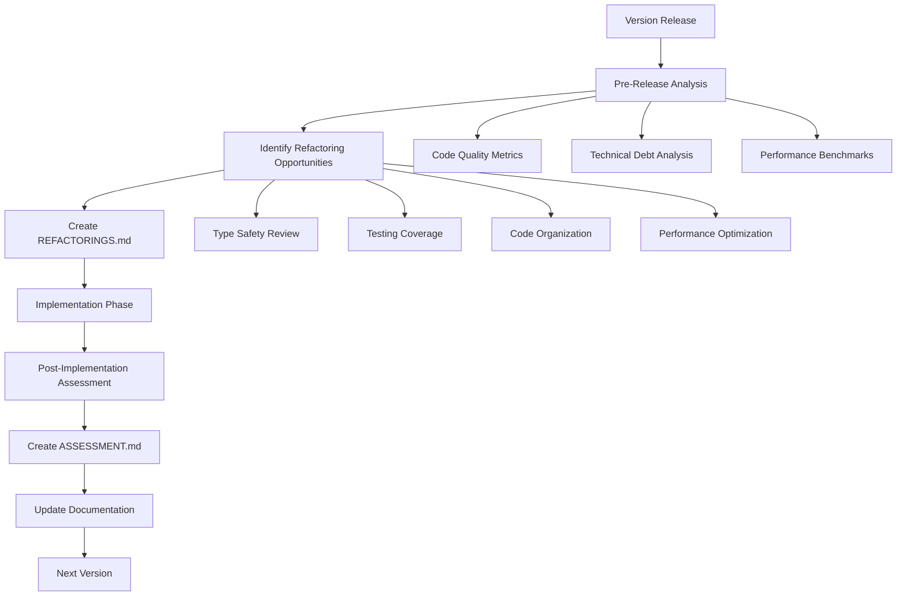

# DOSOUND Tracker - Architecture Guidelines for Refactoring

This document provides comprehensive guidelines for the Architect AI agent to conduct refactoring analysis, proposal creation, and assessment for each version release of the DOSOUND Tracker project.

## Overview

The refactoring process follows a structured approach to ensure systematic improvement of code quality, maintainability, and performance. Each version release should include:

1. **Pre-Release Analysis**: Assessment of current codebase state
2. **Refactoring Proposal**: Identification and prioritization of improvement opportunities
3. **Implementation Planning**: Detailed specifications for proposed changes
4. **Post-Implementation Assessment**: Verification of completed work

## Process Workflow



## 1. Pre-Release Analysis

### Codebase Assessment Checklist

#### Type Safety Analysis
- [ ] Scan for `any` types in production code
- [ ] Review TypeScript strict mode compliance
- [ ] Check runtime type validation coverage
- [ ] Identify unsafe type assertions

#### Testing Infrastructure Review
- [ ] Measure current test coverage
- [ ] Evaluate test quality and completeness
- [ ] Check for integration test gaps
- [ ] Assess end-to-end test coverage

#### Performance Metrics
- [ ] UI render time benchmarks (< 16ms target)
- [ ] Memory usage analysis
- [ ] Bundle size monitoring
- [ ] Large list rendering performance

#### Code Quality Metrics
- [ ] Cyclomatic complexity analysis
- [ ] Code duplication detection
- [ ] Dependency analysis
- [ ] Error handling coverage

### Technical Debt Identification

#### High Priority Issues
- Security vulnerabilities
- Critical performance bottlenecks
- Type safety violations
- Missing error boundaries

#### Medium Priority Issues
- Code duplication
- Inconsistent patterns
- Missing documentation
- Test coverage gaps

#### Low Priority Issues
- Code organization improvements
- Minor performance optimizations
- Documentation updates
- Code style consistency

## 2. Refactoring Proposal Creation

### Document Structure (REFACTORINGS.md)

Each refactoring proposal document should follow this structure:

```markdown
# DOSOUND Tracker - Version X.Y.Z Refactoring Proposals

## Executive Summary
[Brief overview of current state and proposed improvements]

## Current State Assessment
[Analysis of what's already completed vs. remaining work]

### ✅ Successfully Completed
[List of completed improvements from previous versions]

### 🔄 Current Status
[Current state of ongoing improvements]

## Proposed Refactorings for Version X.Y.Z

### Phase 1: [Priority Level] - [Category]
[High-level phase description]

#### 1.1 [Specific Refactoring]
**Files**: [affected files]
**Current Issues**: [problems identified]
**Proposed Solution**: [code examples, implementation approach]
**Impact**: [expected benefits]

### Phase 2: [Continue with additional phases]

## Implementation Timeline
[Sprint-based breakdown of work]

## Success Criteria
[Measurable outcomes for each category]

## Risk Assessment
[Low/Medium/High risk categorization]

## Dependencies
[Internal and external requirements]
```

### Refactoring Categories

#### Type Safety & Code Quality
- Eliminate `any` types
- Extract shared business logic
- Implement comprehensive error boundaries
- Add runtime validation

#### Testing Infrastructure
- Unit tests for core logic
- Component integration tests
- Audio processing tests
- End-to-end workflow tests

#### Performance & UX
- Virtual scrolling for large lists
- Error recovery mechanisms
- Enhanced navigation features
- Performance monitoring

#### Code Organization
- Extract business logic hooks
- Create utility libraries
- Update documentation
- API documentation

### Prioritization Framework

#### Priority Levels
- **HIGH**: Critical for stability/security/performance
- **MEDIUM**: Important for maintainability/scalability
- **LOW**: Nice-to-have improvements

#### Risk Assessment
- **LOW**: Minimal impact, easy rollback
- **MEDIUM**: Moderate impact, requires testing
- **HIGH**: Significant changes, careful planning needed

## 3. Implementation Planning

### Detailed Specifications

For each proposed refactoring, provide:

#### Code Examples
```typescript
// Before
const unsafeFunction = (data: any) => {
  return data.property;
};

// After
interface SafeData {
  property: string;
}

const safeFunction = (data: SafeData) => {
  return data.property;
};
```

#### File Structure Changes
```
src/
├── components/
│   ├── ErrorBoundary.tsx    [NEW]
│   └── ...
├── hooks/
│   ├── useTrackOperations.ts [NEW]
│   └── ...
└── utils/
    ├── validation.ts        [UPDATED]
    └── midiUtils.ts         [NEW]
```

#### Testing Requirements
- Unit test coverage targets
- Integration test scenarios
- Performance benchmark criteria

### Dependency Management

#### External Dependencies
- Evaluate impact on bundle size
- Check license compatibility
- Assess maintenance status

#### Internal Dependencies
- Identify coupling points
- Plan migration strategies
- Consider backward compatibility

## 4. Post-Implementation Assessment

### Assessment Document Structure (ASSESSMENT.md)

```markdown
# DOSOUND Tracker - Version X.Y.Z Refactoring Assessment

## Executive Summary
[Overall completion status and key findings]

## Current Implementation Status

### ✅ Fully Implemented
[Detailed analysis of completed work]

### 🔄 Partially Implemented
[Status of incomplete features]

### ❌ Not Implemented
[Gap analysis for missing features]

## Detailed Analysis by Phase
[Per-phase completion metrics]

## Success Criteria Evaluation
[Checklist-based verification]

## Risk Assessment
[Updated risk analysis]

## Recommendations
[Next steps and priorities]
```

### Verification Methods

#### Automated Checks
- TypeScript compilation
- Test suite execution
- Linting and formatting
- Bundle size analysis

#### Manual Verification
- Code review
- Performance testing
- User acceptance testing
- Documentation review

### Metrics Collection

#### Quantitative Metrics
- Test coverage percentage
- Bundle size changes
- Performance benchmark results
- Type safety compliance

#### Qualitative Assessment
- Code readability improvements
- Maintenance effort reduction
- Developer experience enhancements
- User experience improvements

## 5. Documentation Updates

### Version-Specific Documentation
- Update `docs/prompt/refactoring/X.Y.Z/` with new proposal and assessment
- Maintain historical record of all refactoring efforts
- Cross-reference related changes in `docs/prompt/changes/`

### Project-Level Documentation
- Update API documentation
- Refresh component documentation
- Maintain testing guidelines
- Update contribution guidelines

## 6. Continuous Improvement

### Feedback Integration
- Collect developer feedback on refactoring impact
- Monitor performance metrics post-implementation
- Track maintenance effort changes
- Assess user experience improvements

### Process Refinement
- Review effectiveness of prioritization framework
- Update risk assessment methodologies
- Refine success criteria definitions
- Improve documentation templates

## 7. Tooling and Automation

### Recommended Tools
- TypeScript for type safety analysis
- ESLint for code quality metrics
- Jest/Vitest for test coverage
- Bundle analyzer for size monitoring
- Performance monitoring tools

### Automation Opportunities
- Automated type safety scanning
- Test coverage reporting
- Performance regression detection
- Documentation generation

## Conclusion

Following these guidelines ensures systematic, measurable improvement of the DOSOUND Tracker codebase. Each version release should build upon previous refactoring efforts, maintaining momentum toward production-ready code quality standards.

**Key Principles**:
- Always prioritize type safety and error handling
- Maintain comprehensive test coverage
- Focus on performance and user experience
- Document all changes thoroughly
- Measure impact and learn from each cycle