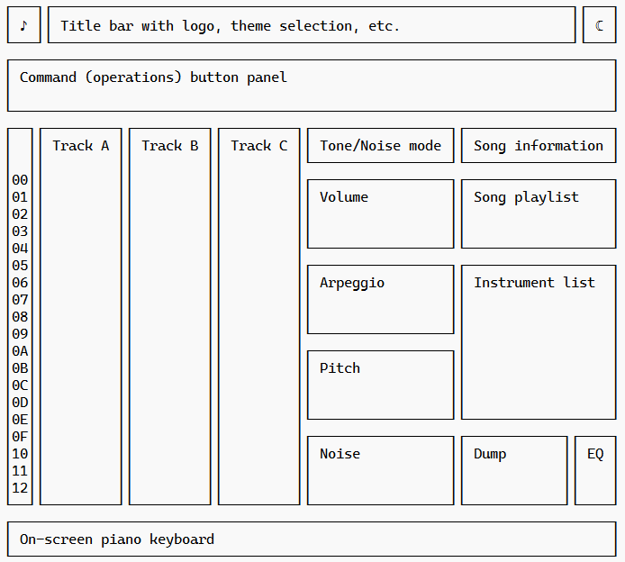
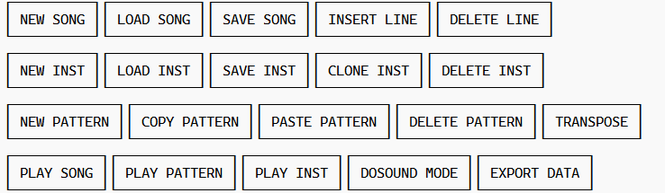
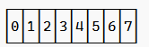
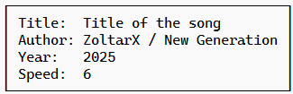
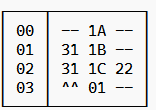
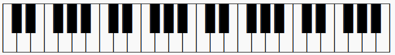
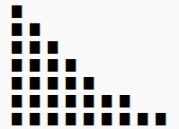
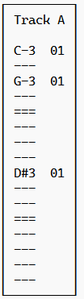

# Project Guidelines

This document outlines the coding conventions and specific implementation requirements for the `dosound-tracker` project, ensuring consistency and accuracy in emulating the Atari ST's audio system.

## AI Assistants and Code Generators

- All tools that generate, analyze, or refactor code must **ignore** every file under the `docs/prompt/` directory.
- Files in `docs/prompt/` are project prompts and design notes, not source code, and must not be used as templates or modified automatically.

## File Format

Reading and writing the complete song, as well as the selected instrument, should use the YAML text format for readability.

## Naming Conventions

### React Components

**Naming:** Use **PascalCase** for component file names (e.g., `InstrumentPanel.js`, `TrackerView.js`).

**Props:** Use **camelCase** for all component properties. Destructure props at the top of the component function.

### General JavaScript

**Variables/Functions:** Use **camelCase** (e.g., `calculateFrequency`, `trackData`).

**Constants:** Use **SCREAMING_SNAKE_CASE** for global constants, especially those related to YM2149 register values (e.g., `YM_BASE_CLOCK`, `MAX_CHANNEL_VOLUME`).

## YM2149 / DOSOUND Implementation

The emulation logic is split into two core areas under `src/synth/`.

### YM2149 Chip Emulation (`src/synth/ym2149/`)

**Core Logic:** This module is responsible for the low-level register simulation.

 * Implement functions to handle the 14 programmable YM2149 registers (R0 through R13).

 * Ensure accurate calculation of tone frequencies, noise generation, and envelope shapes.

### DOSOUND Driver Logic (`src/synth/dosound/`)

**Data Format:** The DOSOUND format uses a specific **packed data structure** to define musical events, often relying on delays and data blocks rather than a simple note-on/note-off stream.

**Parsing:** The logic here must correctly read and interpret the DOSOUND data format (or its abstracted representation) and translate these events into sequential register writes for the YM2149 emulator.

**Playback Rate:** The timing must be tied to the Atari ST's 50Hz VBLANK (or equivalent), as the original DOSOUND routine relied on this timing.

## Sequencer Logic

**Timing:** The main sequencer loop (`useSequencer.js`) must be driven by high-precision timing (e.g., using `requestAnimationFrame` or Web Audio's internal clock) and calculate musical time (BPM, Ticks per Row) relative to the **50Hz update rate** of the DOSOUND driver.

**Playback speed:** is a value that determines the time in cycles between consecutive positions of the pattern. The minimum allowable value is 2.
Due to the limitations of the DOSOUND mode, only even values can be selected in this mode.

**Instrument Definition:** The instrument structure must accurately map UI elements (Volume Envelope (0-15), Vibrato Envelope (-128 to +128 frequency in "cents"), Noise Generator Value (0-31), Tone/Noise Selection, Arpeggio (-24 to +24 semitones) to the parameters required by the YM2149 chip and the DOSOUND logic.

**Playback:** The playback procedure should behave exactly as the DOSOUND function from the XBIOS subsystem does. If, at a given moment, more than one instrument specifies a value for noise, only the last value should be taken into account. If the values do not change in a given cycle, the delay should be extended accordingly for optimization purposes.

## Data Management

Allow exporting the full song or individual instrument definitions into a raw **assembly language data format** (`dc.b` directives), ready to be included and played back by custom Atari ST software.

Support loading and saving complete songs or individual instrument definitions.

**Export Optimization:** The DOSOUND format export must be efficient and optimized. When an instrument's volume is silenced (volume = 0), all remaining sequence data for that channel (noise, pitch changes, arpeggio) must be ignored and excluded from the exported data stream to minimize memory usage and processing overhead on the target Atari ST system.

## User interface

The UI must be **simple, monospaced, DOS-like**. Avoid complex modern UI features where simple text/pseudo-graphic rendering is sufficient.

**Hexadecimal Display:** Use hexadecimal notation (0x prefix) for displaying all hardware-related values in the user interface, including position numbers, instrument IDs, pattern positions, and register values. This maintains consistency with the underlying Atari ST hardware and assembly format.

The note C♯ is written as "C#".

## User interface 

The application screen should fit entirely within the browser tab so that using the scroll bar is not necessary.

The application should support both a night mode (dark, default) and a day mode (light).

In the top-right corner of the user interface, there should be an icon to switch the theme from light to dark.
Place the application logo in the top-left corner. 
Use the 🎶 emoji as the application icon.

It is necessary to implement keyboard support for the application. The active section should be highlighted, and navigation between individual sections should be done using the TAB key in a clockwise direction or Shift+TAB in reverse order. Keyboard shortcuts for specific functions will also be supported.

Let us assume that the application will be displayed on an HD screen with a resolution of 1920×1080. However, since the application runs in a browser, the usable workspace is slightly smaller. It is necessary to implement automatic scaling so that the user can slightly reduce the size of the browser window.

Individual blocks, however, can be scrolled. This applies both to the positions within a pattern and to the instrument list or the playlist entries, which can be shifted vertically within their local area. The interface should properly react to position changes so that the current element is always centered vertically, and navigation icons (up, down) will need to be added to the mentioned blocks.

For the volume envelope blocks and other sequence-based sections, horizontal navigation is required.

All three track blocks (A, B, and C) must be scrolled simultaneously together with the block containing the position number.

Each block should have at least one corresponding React block definition to ensure clarity and ease of future extension.

The graphical layout is illustrated below using semigraphic characters, but each section is accompanied by an image.

### Interface layout

The overall layout of the application is as follows, labels indicate the type of each section.

```
┌───┐┌───────────────────────────────────────────────┐┌─┬─┬─┬─┬─┬─┬─┬─┐┌───┐
│ ♪ ││ Title bar with title, theme selection, etc    ││0│1│2│3│4│5│6│7││ ☾ │
└───┘└───────────────────────────────────────────────┘└─┴─┴─┴─┴─┴─┴─┴─┘└───┘
┌──────────────────────────────────────────────────────────────────────────┐
│ Command (operations) button panel                                        │
│                                                                          │
└──────────────────────────────────────────────────────────────────────────┘
┌──┐┌─────────┐┌─────────┐┌─────────┐┌─────────────────┐┌──────────────────┐
│  ││ Track A ││ Track B ││ Track C ││ Tone/Noise mode ││ Song information │
│  ││         ││         ││         │└─────────────────┘└──────────────────┘
│00││         ││         ││         │┌─────────────────┐┌──────────────────┐
│01││         ││         ││         ││ Volume          ││ Song playlist    │
│02││         ││         ││         ││                 ││                  │
│03││         ││         ││         ││                 ││                  │
│04││         ││         ││         │└─────────────────┘└──────────────────┘
│05││         ││         ││         │┌─────────────────┐┌──────────────────┐
│06││         ││         ││         ││ Arpeggio        ││ Instrument list  │
│07││         ││         ││         ││                 ││                  │
│08││         ││         ││         ││                 ││                  │
│09││         ││         ││         │└─────────────────┘│                  │
│0A││         ││         ││         │┌─────────────────┐│                  │
│0B││         ││         ││         ││ Pitch           ││                  │
│0C││         ││         ││         ││                 ││                  │
│0D││         ││         ││         ││                 ││                  │
│0E││         ││         ││         │└─────────────────┘└──────────────────┘
│0F││         ││         ││         │┌─────────────────┐┌────────────┐┌────┐
│10││         ││         ││         ││ Noise           ││ Dump       ││ EQ │
│11││         ││         ││         ││                 ││            ││    │
│12││         ││         ││         ││                 ││            ││    │
└──┘└─────────┘└─────────┘└─────────┘└─────────────────┘└────────────┘└────┘
┌──────────────────────────────────────────────────────────────────────────┐
│ On-screen piano keyboard                                                 │
└──────────────────────────────────────────────────────────────────────────┘
```



### Commands (operations) button panel.

The buttons are arranged in several rows and should be placed at the top of the user interface.

```
┌──────────┐┌───────────┐┌───────────┐┌─────────────┐┌─────────────┐
│ NEW SONG ││ LOAD SONG ││ SAVE SONG ││ INSERT LINE ││ DELETE LINE │
└──────────┘└───────────┘└───────────┘└─────────────┘└─────────────┘
┌──────────┐┌───────────┐┌───────────┐┌────────────┐┌─────────────┐
│ NEW INST ││ LOAD INST ││ SAVE INST ││ CLONE INST ││ DELETE INST │
└──────────┘└───────────┘└───────────┘└────────────┘└─────────────┘
┌─────────────┐┌──────────────┐┌───────────────┐┌────────────────┐┌───────────┐
│ NEW PATTERN ││ COPY PATTERN ││ PASTE PATTERN ││ DELETE PATTERN ││ TRANSPOSE │
└─────────────┘└──────────────┘└───────────────┘└────────────────┘└───────────┘
┌───────────┐┌──────────────┐┌───────────┐┌──────────────┐┌─────────────┐
│ PLAY SONG ││ PLAY PATTERN ││ PLAY INST ││ DOSOUND MODE ││ EXPORT DATA │
└───────────┘└──────────────┘└───────────┘└──────────────┘└─────────────┘
```



### Octave selection

This block alows user to select base octave, default is 3.
Minimum is 0 and maximum is 7.

```
┌─┬─┬─┬─┬─┬─┬─┬─┐
│0│1│2│3│4│5│6│7│
└─┴─┴─┴─┴─┴─┴─┴─┘
```



### Song information

The music settings include fields allowing the user to specify the title of the tune, the year, the author, and the playback speed (the speed parameter).

```
┌───────────────────────────────────┐
│ Title:  Title of the song         │
│ Author: Zoltar X / New Generation │
│ Year:   2025                      │
│ Speed:  6                         │
└───────────────────────────────────┘
```



### Song playlist

The playlist contains the recorded music arrangement. Each row corresponds to one “song line,” specifying the pattern number for each of the three tracks.

```
┌────┬──────────┐
│ 00 │ -- 1A -- │
│ 01 │ 31 1B -- │
│ 02 │ 31 1C 22 │
│ 03 │ ^^ 01 -- │
└────┴──────────┘
```

This block is scrolled vertically.



Such a notation means that three arrangement rows are defined. In the first row, pattern 1A will be played on track B; in the second row, pattern 31 on track A and 1B on track B; and in the third row, pattern 31 on track A, 1C on track B, and pattern 22 on track C.

The last row, numbered 03, contains a GOTO command specifying the row number to which playback should jump. This is relevant only during playback, since the DOSOUND function does not support such a jump, and the music playback should end at this point.

### On-screen piano keyboard

On-screen piano keyboard that allows playing sounds and selecting a key signature for playback using the “PLAY INST” function.

It should be located at the bottom of the user interface.

```
┌─┬─┬┬─┬─┬─┬─┬┬─┬┬─┬─┬─┬─┬┬─┬─┬─┬─┬┬─┬┬─┬─┬─┬─┬┬─┬─┬─┬─┬┬─┬┬─┬─┬─┬─┬┬─┬─┬─┬─┬┬─┬┬─┬─┐
│ │ ││ │ │ │ ││ ││ │ │ │ ││ │ │ │ ││ ││ │ │ │ ││ │ │ │ ││ ││ │ │ │ ││ │ │ │ ││ ││ │ │
│ │ ││ │ │ │ ││ ││ │ │ │ ││ │ │ │ ││ ││ │ │ │ ││ │ │ │ ││ ││ │ │ │ ││ │ │ │ ││ ││ │ │
│ └┬┘└┬┘ │ └┬┘└┬┘└┬┘ │ └┬┘└┬┘ │ └┬┘└┬┘└┬┘ │ └┬┘└┬┘ │ └┬┘└┬┘└┬┘ │ └┬┘└┬┘ │ └┬┘└┬┘└┬┘ │
│  │  │  │  │  │  │  │  │  │  │  │  │  │  │  │  │  │  │  │  │  │  │  │  │  │  │  │  │
└──┴──┴──┴──┴──┴──┴──┴──┴──┴──┴──┴──┴──┴──┴──┴──┴──┴──┴──┴──┴──┴──┴──┴──┴──┴──┴──┴──┘
```



If the focus is on the on-screen piano keyboard block, pressing the keys corresponding to piano keys should play the sound of the currently selected instrument at the specific note and octave according to the current settings.

Some of the keyboard keys are mapped to the same piano notes.

| Keyboard key | Piano note | Relative octave |
| :----------: | :--------: | :-------------: |
| Z            | C          | +0              |
| S            | C#         | +0              |
| X            | D          | +0              |
| D            | D#         | +0              |
| C            | E          | +0              |
| V            | F          | +0              |
| G            | F#         | +0              |
| B            | G          | +0              |
| H            | G#         | +0              |
| N            | A          | +0              |
| J            | A#         | +0              |
| M            | B          | +0              |
| ,            | C          | +1              |
| L            | C#         | +1              |
| .            | D          | +1              |
| ;            | D#         | +1              |
| /            | E          | +1              |
| Q            | C          | +1              |
| 2            | C#         | +1              |
| W            | D          | +1              |
| 3            | D#         | +1              |
| E            | E          | +1              |
| R            | F          | +1              |
| 5            | F#         | +1              |
| T            | G          | +1              |
| 6            | G#         | +1              |
| Y            | A          | +1              |
| 7            | A#         | +1              |
| U            | B          | +1              |
| I            | C          | +2              |
| 9            | C#         | +2              |
| O            | D          | +2              |
| 0            | D#         | +2              |
| P            | E          | +2              |
| [            | F          | +2              |
| +            | F#         | +2              |
| ]            | G          | +2              |


## Evelope view

This kind of block is used for "Volume", "Arpeggio", "Pitch" and "Noise".
Remember that "Arpeggio" and "Pitch" contains relative values where 0 is in the middle and means "no change".
For "Volume" and "Noise" 0 is minimum value. Maximum value for "Volume" is F and for "Noise" is 1F.
All these blocks should be scrolled simultaneously together and navigation should be possible with arrow keys.

Example of the contents of an envelope block:

```
 █ 
 █ █   
 █ █ █ 
 █ █ █ █ 
 █ █ █ █ █ 
 █ █ █ █ █ █ █               
 █ █ █ █ █ █ █ █ █    
```



This block is scrolled horizontally together with all other envelope blocks as well as "Tone/Noise" block.

## Tone/Noise

This block is very short because it contains only the setting (TONE or NOISE) of the generator’s operating mode along the timeline.

## Track

```
┌─────────┐
│ Track A │
│         │
│ C-3  01 │
│ ---     │
│ G-3  01 │
│ ---     │
│ ===     │
│ ---     │
│ ---     │
│ ---     │
│ D#3  01 │
│ ---     │
│ ---     │
│ ===     │
│ ---     │
│ ---     │
│ ---     │
│ ---     │
└─────────┘
```



Each row contains no operation "---" or a note together with instrument number like "C#3 05" which means C# note with octave 3 and instrument number 05.

If the focus is on any block of a track, it should be possible to enter note values using both the on-screen keyboard and the keys representing individual notes on the piano keyboard.

Empty (no instruction) position is indicated with "---".

If Space or Backspace is pressed current position should be cleared.
If Ctrl+Space is pressed, then note off "===" should be set at the position.
If Ctrl together with - (minus) is pressed, then previous intrument should be selected.
If Ctrl together with + (plus) is pressed, then next instrument should be selected.

### Dump

Dump block should contain current values for all chip registers that are in use by the player routine in hexadecimal format.

### EQ

This is simple volume bar for each track (3 vertical bars).

### Navigation

Block order for navigation using the keyboard:

 - Octave selection
 - Theme mode (dark/light)
 - Track A
 - Track B
 - Track C
 - Tone/Noise
 - Volume
 - Arpeggio
 - Pitch
 - Noise
 - Song information
 - Song playlist
 - Instrument List
 - On-screen piano keyboard

Don't focus on Dump, EQ nor logo or title.
